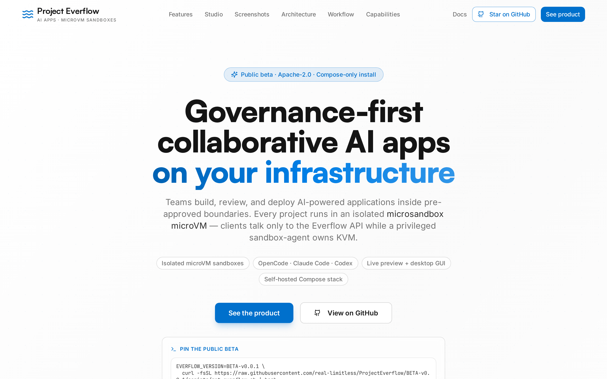
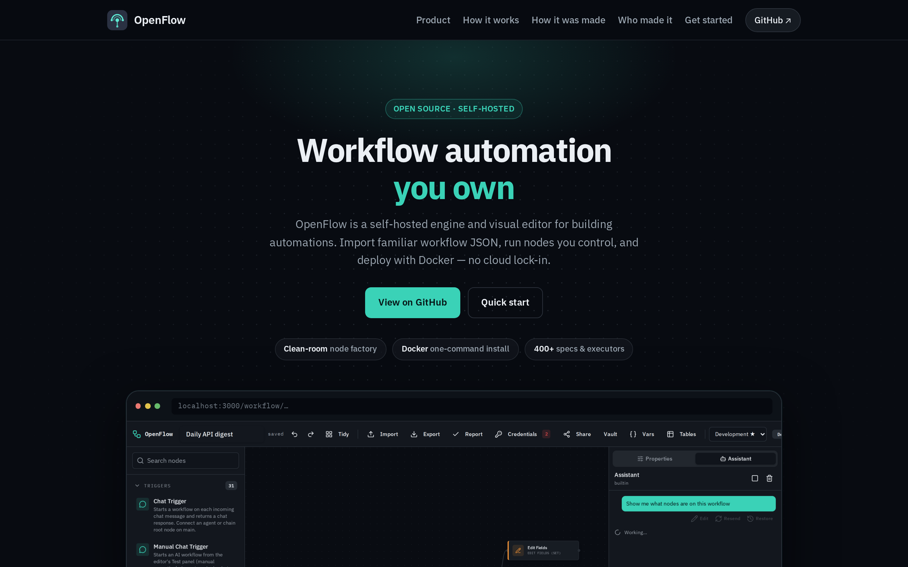
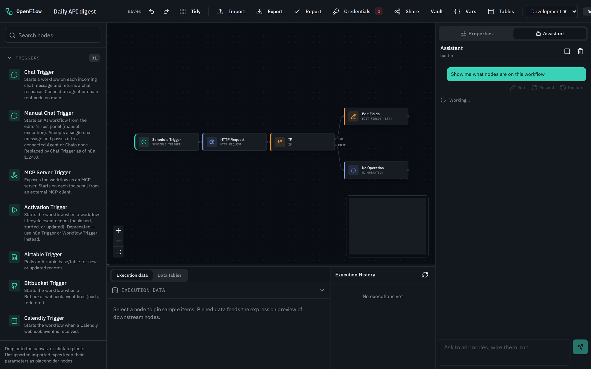
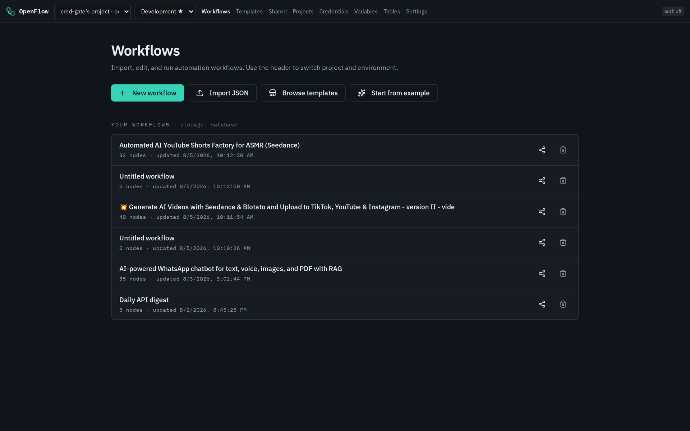
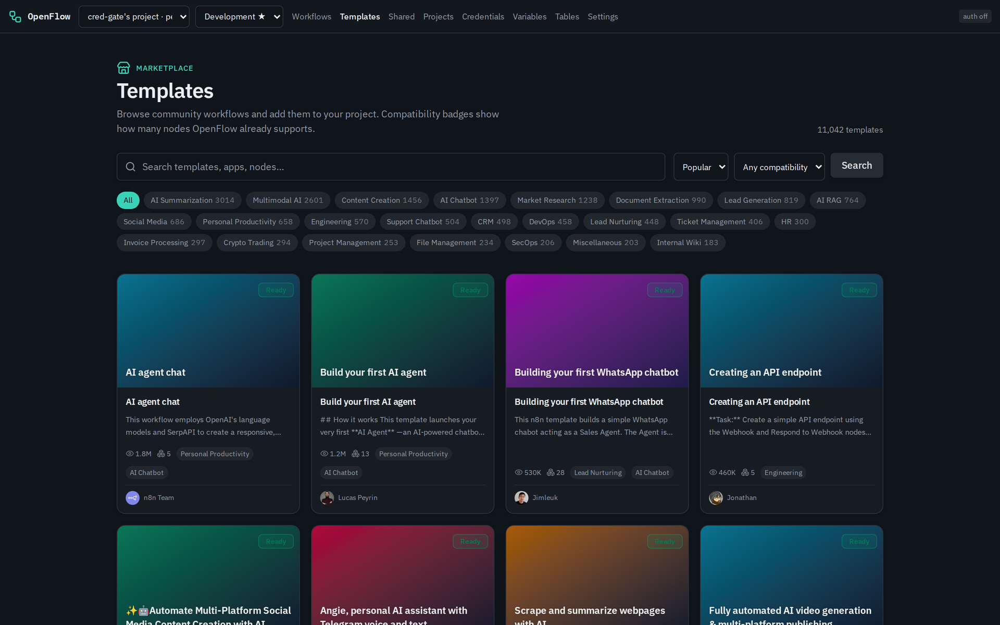
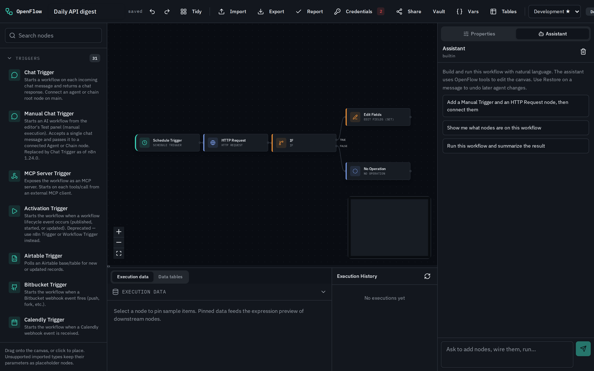
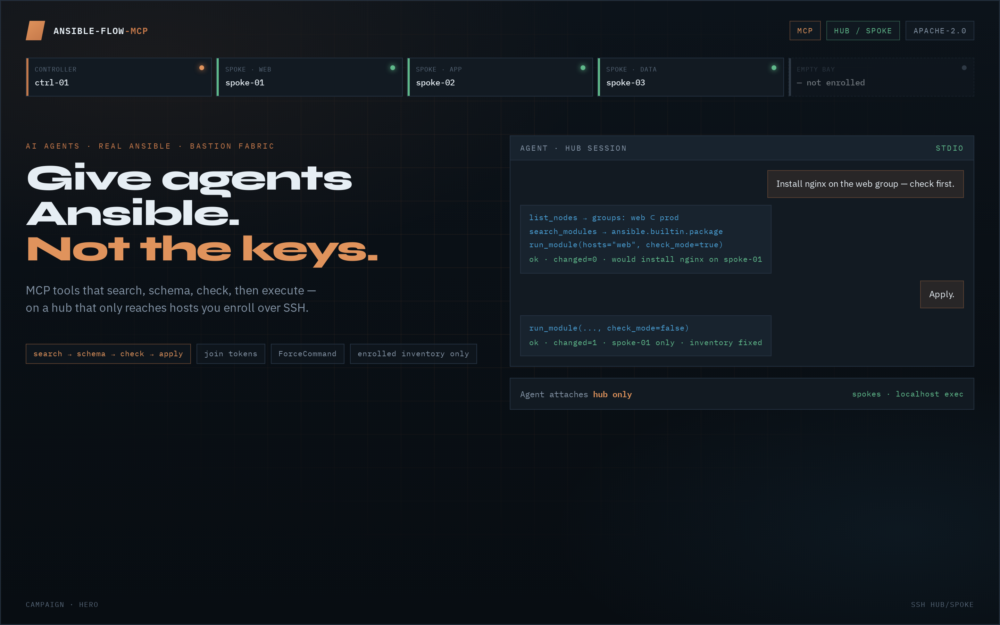
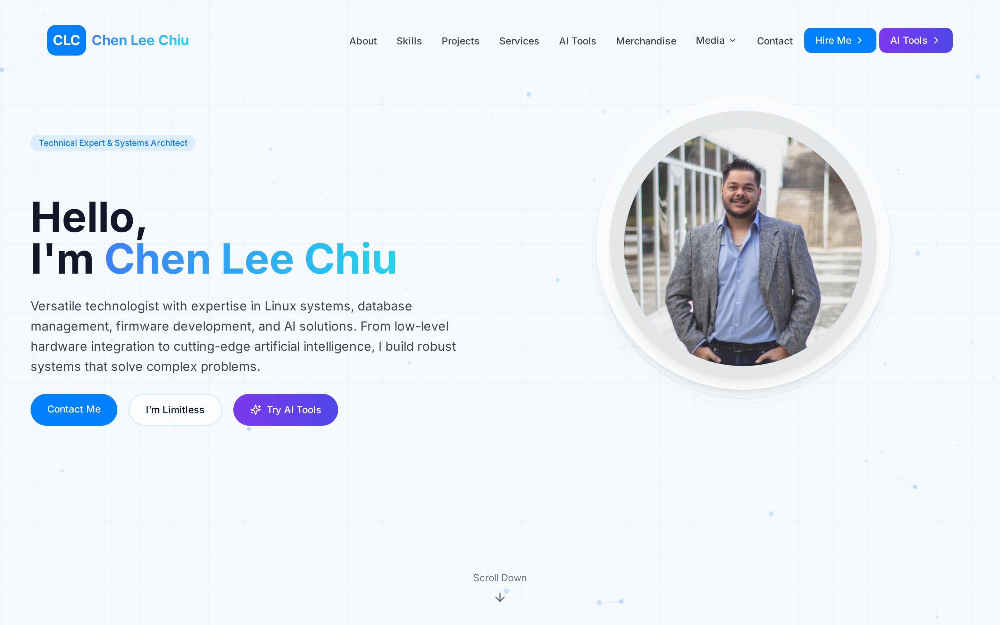

# 👋 Hi there, I'm Chen Chiu **(Limitless)**
## 🚀 About Me

I'm **Chen**, known online as **LIMITLESS**. I'm a builder who ships self-hosted platforms, AI agent systems, and full-stack products. I work at **Red Hat**, and my views here are solely my own.

I care about **making sure you own your infrastructure**: clean-room open source, Docker/Podman-first deploys, governance around AI, and tools that stay under *your* control. Whether I'm designing workflow engines, multi-agent systems, or containerized dev environments, its all the same! I want to build systems people can run, inspect, and extend into the forseeable future.
I dont like being vendor locked, into a provider. I like giving the people a choice.

**Unlimited** is my favorite word. If it has that label, I'm already interested.

I'm always open to open conversations on AI technology: architecture, governance, inference, agents, or whatever you're building. Reach out.

---

## 🎩 Red Hat

I support and work across the Red Hat AI & platform stack:

| Product | Focus |
| --- | --- |
| **RHOAI** (Red Hat OpenShift AI) | Enterprise AI platforms on OpenShift |
| **RHAIIS** (Red Hat AI Inference Server) | Production model serving & inference |
| **RHEL AI** | AI-ready RHEL for model workloads |
| **RHEL Lightspeed** | AI-assisted RHEL operations |

### Certifications

---

## 💼 What I Do

I specialize in:

- **🔄 Self-Hosted Workflow Automation**: n8n-compatible engines, visual editors, clean-room implementations
- **🤖 AI Agents & Multi-Agent Systems**: orchestration, tool use, governance, streaming UX
- **🛡️ Agent-Safe Ansible**: MCP control planes with check-first rituals and enrolled hub/spoke fleets
- **☁️ Container-Native Platforms**: Docker, Podman, compose stacks, GHCR, one-line installers
- **🧩 Full-Stack Product Engineering**: TypeScript/React frontends, Django/Node APIs, real-time data
- **🏢 Enterprise AI Platforms**: governed workspaces, RBAC, skills/MCP/project marketplaces

---

## 🛠️ My Favorite Tools

Here are the tools that power my daily workflow:

<table>
<tr>
<td width="33%" align="center">

### ⌨️ [OpenCode](https://opencode.ai)
**Agentic Coding CLI**

My preferred agent harness for multi-step engineering work: skills, subagents, and tight repo loops without leaving the terminal.

</td>
<td width="33%" align="center">

### 📦 [Podman](https://podman.io/)
**Daemonless Containers**

Rootless-friendly containers for local and prod-ish stacks. Powers DevTainer, OpenFlow compose, and most of my self-host work.

</td>
</tr>
<tr>
<td width="33%" align="center">

### 🧠 [OpenRouter](https://openrouter.ai)
**Multi-Model AI Access**

One API, many brains. GPT, Claude, and open models for agent consensus, streaming analysis, and product features.

</td>
<td width="33%" align="center">

### ⚡ OpenFlow
**Workflow Automation**

Visual automation graphs I both *use* and *rebuild*. OpenFlow is my clean-room, self-hosted take on n8n-compatible definitions.

</td>
</tr>
</table>

---

## 🏛️ Flagship: [Project Everflow](https://github.com/real-limitless/ProjectEverflow)

**The enterprise AI platform that owns the full suite.** Think Visual Studio, Cursor, and OpenWebUI rolled into one, with enterprise governance, RBAC, and a marketplace for Skills, MCPs, and projects.

Everflow is the platform layer. Teams build, review, and deploy AI-powered apps inside **pre-approved boundaries**, with isolated microVM sandboxes and a single public platform API. **OpenFlow** lives inside this world as the workflow automation engine. The two tie together: Everflow is the governed surface; OpenFlow is the automation fabric underneath.

  

**Marketing site:** [EverFlow](https://everflow.bot/)

**Tech Stack:**     

---

## 🌊 Flagship: [OpenFlow](https://github.com/real-limitless/OpenFlow)

**Self-hosted workflow automation you own.** An independent open-source engine oriented toward publicly documented, **n8n-compatible** workflow definitions, built with a deliberate **clean-room** process.

Docker-first (`docker compose up -d`), visual editor, template marketplace, credentials vault, and an AI assistant in the canvas. Part of the **Everflow** platform story: automation graphs that plug into a broader enterprise AI suite.

  

  

| Workflows | Templates | Canvas |
| :---: | :---: | :---: |
|  |  |  |

**Marketing site:** [real-limitless.github.io/OpenFlow](https://real-limitless.github.io/OpenFlow/)

**Tech Stack:**      

---

## ⚙️ Flagship: [ansible-flow-mcp](https://github.com/real-limitless/ansible-flow-mcp)

**Give agents Ansible. Not the keys.** MCP server that exposes real Ansible modules and playbooks to AI agents — with a check-first ritual and an SSH hub/spoke fabric so multi-host automation is enrolled, bastion-scoped, and never god-mode freestyle.

Two tracks: **agent loop** (`search → schema → check → execute` on allowlisted collections) and **fleet fabric** (one hub · join tokens · ForceCommand spokes · fixed inventory). Dual-tracked with the **OpenFlow** Ansible gallery.

  

**Release:** [v0.1.0](https://github.com/real-limitless/ansible-flow-mcp/releases/tag/v0.1)

**Tech Stack:**     

---

## 🎯 Featured Projects

### 📈 [chiu.best](https://github.com/real-limitless/chiu.best)
AI-powered stock analysis platform with **8 specialized agents** (fundamental, technical, sentiment + competition/policy/macro/risk/insider), real-time quotes, watchlists, portfolio tracking, and streaming chat. React + Django + OpenRouter.

  

**Tech Stack:**     

### 🧰 [DevTainer](https://github.com/real-limitless/DevTainer)
Containerized developer environment launched via **x11docker + Podman**: shell, VS Code, Claude/Gemini/Grok/OpenCode CLIs, and Ollama, with your projects bind-mounted in.

**Tech Stack:**   

### 📚 [n8n-workflow-library](https://github.com/real-limitless/n8n-workflow-library)
Unofficial attributed collection of public n8n Community workflows: importable graphs, catalog/manifest tooling, and attribution verification. Not affiliated with n8n GmbH.

**Tech Stack:**   

---

## 🔧 Tech Stack & Skills

### Languages

### Frontend & App UI

### Backend & Data

### AI & Automation

### Platforms & Ops

---

## 📖 How I Got Here

I've been in technology since I was a kid in high school: services, websites, networks, anything I could get my hands on. I own the nerd title. I don't get offended by it. I know who I am, and I'm thankful for it. It got me here.

### Early days
- In **8th grade**, I stood up my own web host, [CloudFilez](https://web.archive.org/web/20120808062418/http://cloudfilez.org/). That summer taught me more than any class.
- Around then I wrote macros and bots to autoclick and surf ads. Crude automation, real lessons.
- In high school I sold VPN access to friends so they could bypass the school firewall.
- Teachers pulled me out of class to fix their computers. Extra credit for making machines work. I was the IT kid.
- I had every mod that existed on the **PSP**. I knew that device cold, including building my own **Pandora battery** to unbrick it.
- Dedicated network shares in the computer labs so friends and I could coop **GTA** or **Halo** from any lab on campus.

### Later tinkering
- Personal work on the **PS3**, and **Call of Duty MW2** mods in the summer of **2013**.
- Ran a **PBX** server in **2012** with custom IVR prompts.
- Still dabble across the stack: algorithmic trading with **AI/ML robots**, and a real knack for **3D printing**.

### Values
You can feel the wrath of Chen at the hint of any injustice. I don't like oversized government. I want a fair level playing field. Build in the open. Own your stack. Keep the ground even.

---

## 🤝 Focus Areas

- **Self-hosted AI & automation**: agents, workflows, sandboxes, data sovereignty
- **Enterprise AI platforms**: Everflow-class governance, RBAC, skills/MCP marketplaces
- **Agent-safe Ansible / MCP control planes**: check-first modules, enrolled hub/spoke fleets
- **Clean-room / independent open source**: compatible interfaces without copying proprietary engines
- **Productized full-stack builds**: from compose files to polished React UIs
- **Container-native developer tooling**: reproducible environments and compose-first deploys
- **Red Hat AI stack**: RHOAI, RHAIIS, RHEL AI, RHEL Lightspeed

---

## 📫 Let's Connect!

### ☕ Tip Jar

If something I built saved you time, fueled a late-night deploy, or just made the stack a little more *yours*, [buy me a coffee](https://buymeacoffee.com/real.limitless). Every tip keeps the open-source lights on.

### 🎸 Life Off the Keyboard: [FestivalPass](https://festivalpass.com/register?ref=Chen285886)

Code is how I build. **Live music is how I remember I'm alive.**

I go to a *lot* of concerts: stages, pits, festivals, late exits under parking-lot lights. And I do it through **[FestivalPass](https://festivalpass.com/register?ref=Chen285886)**. Same obsession as engineering: remove friction, maximize signal. FestivalPass is the membership that turns "I wish I could go" into "I'll be there". Concerts, shows, hotels, the whole circuit.

There's something profound in standing in a crowd when the drop hits: no backlog, no merge conflict, no sprint board. Just sound, strangers, and the brief proof that the universe still has volume. Building systems that scale is my craft. Showing up for the art that scales *us* is the balance. Unlimited on the repo. Unlimited in the room.

**Join FestivalPass** (my ref): [festivalpass.com/register?ref=Chen285886](https://festivalpass.com/register?ref=Chen285886)

### 🤝 Open for Collaboration!

I'm always interested in projects involving:
- **Self-hosted workflow engines and automation platforms**
- **Governed AI agent systems and sandboxed agent runtimes**
- **Agent-safe Ansible and MCP control planes for real fleets**
- **Full-stack AI product builds (React + Python/Node)**
- **Open source tooling people can actually run**
- **Open conversations on AI technology** (no pitch required)

Feel free to open an issue on one of my repos, star something you're using, or reach out if you want to collaborate. Or just talk AI.

---

*"I'm Chen AKA LIMITLESS. Views are my own."* ♾️

**Last updated:** August 2026

